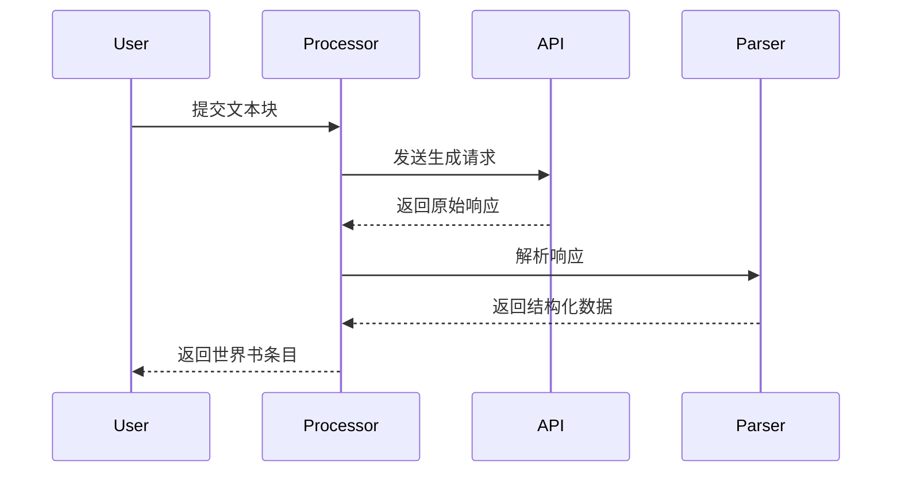
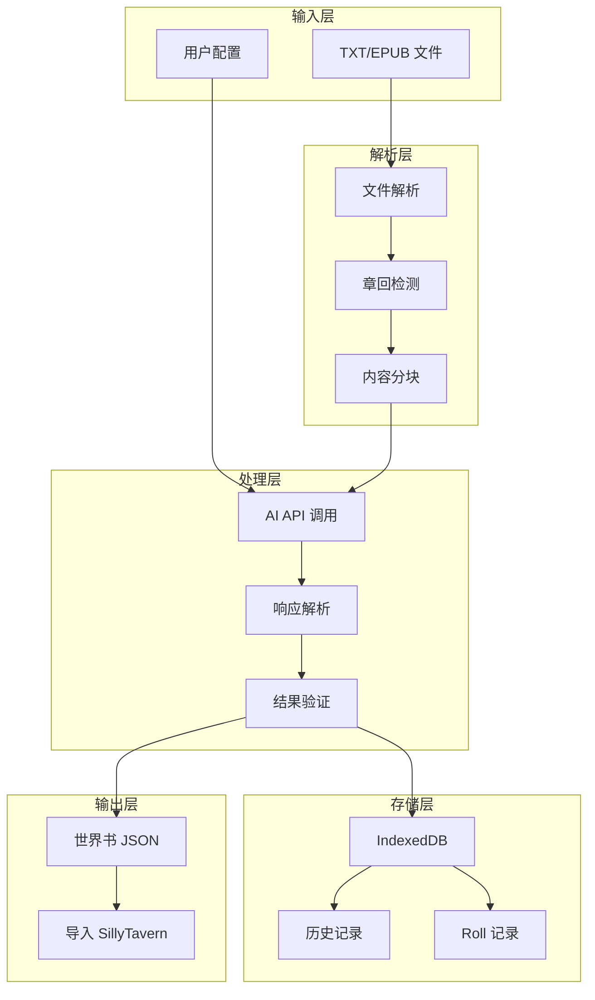
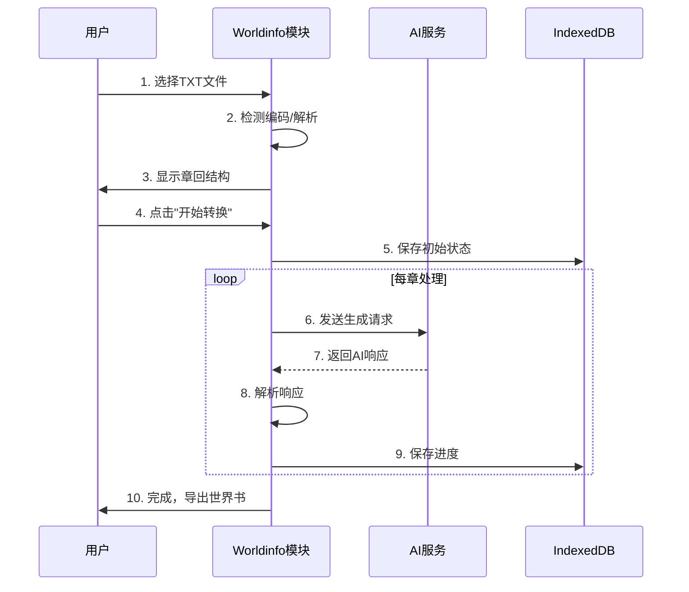

# Worldinfo 模块 - 详细功能说明文档

> **版本**: v2.0.0  
> **更新日期**: 2026-02-21  
> **作者**: Novel Auto Generator Team

---

## 📚 目录

1. [模块概述](#-模块概述)
2. [核心功能](#-核心功能)
3. [架构设计](#-架构设计)
4. [详细使用指南](#-详细使用指南)
5. [配置说明](#-配置说明)
6. [API 参考](#-api-参考)
7. [数据库设计](#-数据库设计)
8. [性能优化](#-性能优化)
9. [常见问题](#-常见问题)
10. [更新日志](#-更新日志)

---

## 📖 模块概述

### 什么是 Worldinfo 模块？

Worldinfo 模块是 **Novel Auto Generator** 插件的核心子模块，专注于**TXT 到世界书（Worldbook）的智能转换**。它通过 AI 技术自动分析小说文本，提取关键信息（角色、地点、事件等），并生成结构化的世界书条目。

### 核心能力


### 适用场景

- 🎮 **游戏模组制作**: 为视觉小说、RPG 游戏创建背景设定
- 📖 **小说创作辅助**: 管理长篇小说的世界观和角色设定
- 🤖 **AI 角色扮演**: 为 SillyTavern 等工具提供结构化背景
- 📚 **知识库构建**: 将非结构化文本转换为可检索的知识条目

---

## 🎯 核心功能

### 1. 文件处理

#### 支持的格式
| 格式 | 说明 | 特性 |
|------|------|------|
| TXT | 纯文本文件 | 自动编码检测 (UTF-8/GBK/GB2312) |
| EPUB | 电子书格式 | 自动提取章节结构 |

#### 章回检测
```javascript
// 默认支持的章回格式
第 1 章
第 1 回
第 1 卷
第 1 节
第 1 部
第 1 篇
第一章
第壹章
// 支持自定义正则表达式
```

### 2. 内容分块

#### 分块策略
| 模式 | 说明 | 适用场景 |
|------|------|----------|
| 章回分块 | 按检测到的章回自动分块 | 标准小说结构 |
| 固定大小 | 按指定字数分块 | 无明确章回的长文本 |
| 智能分卷 | 当内容过多时自动分卷 | 超长篇处理 |

#### 分块配置
```javascript
{
  chunkSize: 15000,        // 每块目标字数
  useVolumeMode: false,    // 是否启用分卷模式
  volumeChunkCount: 100,   // 每卷包含的块数
  forceChapterMarker: true // 强制章节标记
}
```

### 3. AI 处理

#### 支持的 API 模式
| 模式 | 说明 | 优势 |
|------|------|------|
| 酒馆 API | 使用 SillyTavern 当前 AI | 无需配置，即开即用 |
| Gemini API | 直连 Google | 速度快，成本低 |
| DeepSeek API | 中文优化 | 价格实惠，中文理解好 |
| OpenAI 兼容 | 支持本地部署 | 数据隐私 |

#### AI 处理流程


### 4. 世界书生成

#### 条目结构
```javascript
{
  // 基础信息
  name: "条目名称",
  keys: "关键词1,关键词2,关键词3",
  
  // 内容
  content: "条目的详细内容...",
  
  // 高级设置
  depth: 4,           // 插入深度 (0-5)
  order: 100,         // 排序优先级
  priority: 100,      // 激活优先级
  
  // 条件
  logic: "and_any",   // 逻辑条件
  
  // 其他
  comment: "备注"
}
```

#### 分类管理
- **默认分类**: 角色、地点、事件、物品、势力、其他
- **自定义分类**: 支持用户自定义分类
- **分类配置**: 每个分类可设置默认参数

### 5. 高级功能

#### 5.1 历史记录与回滚
- **自动保存**: 每次处理自动保存历史
- **版本对比**: 可视化对比不同版本差异
- **一键回滚**: 支持回滚到任意历史版本
- **历史限制**: 最多保留100条历史记录

#### 5.2 Roll 历史
- **章节级别 Roll**: 保存每章的多次生成结果
- **条目级别 Roll**: 支持单个条目的多次重Roll
- **版本对比**: 对比不同Roll结果
- **Roll限制**: 每条目最多保留50条Roll记录

#### 5.3 批量处理
- **断点续传**: 支持中断后从上次位置继续
- **并行处理**: 支持多章节并行生成
- **进度保存**: 实时保存处理进度

#### 5.4 世界书工具
- **查找替换**: 批量替换世界书内容
- **清除标签**: 清理AI响应中的标签
- **整理条目**: AI优化条目内容
- **别名合并**: 识别同义词并合并条目

---

## 🏗️ 架构设计

### 目录结构

```
Worldinfo/
├── api/                          # API 接口层
│   ├── APIService.js            # API 服务基类
│   ├── GeminiAPI.js             # Google Gemini API
│   ├── DeepSeekAPI.js           # DeepSeek API
│   └── OpenAICompatibleAPI.js   # OpenAI 兼容 API
│
├── core/                         # 核心业务逻辑
│   ├── Config.js                # 配置管理
│   ├── State.js                 # 状态管理
│   ├── Processor.js             # 处理器基类
│   ├── ParallelProcessor.js     # 并行处理器
│   ├── ContentSplitter.js       # 内容分块器
│   ├── ChapterDetector.js       # 章回检测器
│   ├── ResponseParser.js        # 响应解析器
│   └── SharedConfigManager.js   # 共享配置管理
│
├── db/                           # 数据库层
│   ├── Database.js              # IndexedDB 封装
│   ├── HistoryStore.js          # 历史记录存储
│   ├── RollStore.js             # Roll 历史存储
│   ├── StateStore.js            # 状态存储
│   └── CategoryStore.js         # 分类存储
│
├── parsers/                      # 文件解析器
│   ├── Parser.js                # 解析器基类
│   ├── TxtParser.js             # TXT 解析器
│   └── EpubParser.js            # EPUB 解析器
│
├── services/                     # 服务层
│   ├── ConversionService.js     # 转换服务
│   ├── WorldbookService.js      # 世界书服务
│   ├── RollService.js           # Roll 服务
│   ├── ExportImportService.js   # 导入导出服务
│   └── ToolService.js           # 工具服务
│
├── ui/                           # 用户界面
│   ├── components/              # 通用组件
│   │   ├── Button.js
│   │   ├── Modal.js
│   │   ├── Card.js
│   │   ├── Input.js
│   │   ├── Select.js
│   │   ├── Table.js
│   │   ├── Tabs.js
│   │   ├── Toast.js
│   │   └── Tooltip.js
│   │
│   └── panels/                  # 面板组件
│       ├── TxtToWorldbookPanel.js
│       ├── EntryEditor.js
│       ├── BatchRerollPanel.js
│       ├── HistoryViewer.js
│       ├── CategoryEditor.js
│       ├── WorldbookViewPanel.js
│       ├── WorldbookExportPanel.js
│       ├── WorldbookImportPanel.js
│       ├── FindReplaceDialog.js
│       ├── AliasMergeDialog.js
│       ├── ClearTagsPanel.js
│       ├── ConsolidatePanel.js
│       ├── DefaultEntriesPanel.js
│       ├── EpubToTxtPanel.js
│       ├── ProcessedResultsPanel.js
│       ├── RollSelector.js
│       └── HelpModal.js
│
├── utils/                        # 工具函数
│   ├── index.js                 # 工具函数入口
│   ├── token.js                 # Token 计算
│   ├── hash.js                  # 哈希计算
│   ├── sort.js                  # 排序算法
│   ├── regex.js                 # 正则工具
│   └── file.js                  # 文件处理
│
└── index.js                     # 模块入口
```

### 数据流图



---

## 📖 详细使用指南

### 快速开始

#### 1. 基本流程



#### 2. 代码示例

```javascript
// 1. 初始化模块
import { TxtToWorldbookConverter } from './index.js';

const converter = new TxtToWorldbookConverter();

// 2. 加载文件
const fileInput = document.getElementById('file-input');
fileInput.addEventListener('change', async (e) => {
    const file = e.target.files[0];
    
    // 解析文件
    const parseResult = await converter.parseFile(file);
    console.log('章回数:', parseResult.chapters.length);
    
    // 显示章回列表
    displayChapters(parseResult.chapters);
});

// 3. 开始转换
async function startConversion(config) {
    // 配置参数
    const options = {
        chunkSize: 15000,
        parallelEnabled: true,
        parallelConcurrency: 3,
        useTavernApi: true,
        // ... 更多配置
    };
    
    // 开始处理
    const result = await converter.process(options, {
        onProgress: (progress) => {
            updateProgressBar(progress.percentage);
            updateStatusText(`正在处理: ${progress.currentChapter}`);
        },
        onComplete: (result) => {
            console.log('处理完成:', result);
            displayResult(result.worldbook);
        },
        onError: (error) => {
            console.error('处理错误:', error);
            showErrorDialog(error);
        }
    });
}

// 4. 导出世界书
function exportWorldbook(worldbook) {
    const blob = new Blob([JSON.stringify(worldbook, null, 2)], {
        type: 'application/json'
    });
    const url = URL.createObjectURL(blob);
    const a = document.createElement('a');
    a.href = url;
    a.download = 'worldbook.json';
    a.click();
}
```

### 高级用法

#### 自定义提示词

```javascript
// 设置自定义提示词
const config = new Config();

// 世界书生成提示词
config.set('customWorldbookPrompt', `
你是一个专业的小说设定整理助手。
请分析以下小说内容，提取关键设定并以 JSON 格式返回。

注意：
1. 只返回 JSON，不要有任何其他内容
2. 角色条目必须包含性格、外貌、背景
3. 地点条目必须包含描述、特点
`);

// 剧情大纲提示词
config.set('customPlotPrompt', `
请为以下章节生成剧情大纲...
`);

// 文风配置提示词
config.set('customStylePrompt', `
请分析以下文本的文风特点...
`);
```

#### 并行处理配置

```javascript
// 启用并行处理
const options = {
    parallelEnabled: true,
    parallelConcurrency: 5,      // 并发数
    parallelMode: 'independent',  // independent | batch
    
    // 批处理模式配置
    batchSize: 3,               // 每批处理的章节数
    batchDelay: 1000,           // 批次间延迟（毫秒）
};

const result = await converter.process(options);
```

#### 断点续传

```javascript
// 检查是否有未完成的状态
const stateStore = new StateStore();
const savedState = await stateStore.load();

if (savedState && savedState.processedIndex < savedState.memoryQueue.length) {
    // 询问用户是否继续
    const shouldContinue = confirm(
        `检测到未完成的处理进度：\n` +
        `已处理: ${savedState.processedIndex}/${savedState.memoryQueue.length}\n` +
        `是否继续？`
    );
    
    if (shouldContinue) {
        // 恢复处理
        await converter.resume(savedState, options);
    } else {
        // 清除状态
        await stateStore.clear();
    }
}
```

---

## ⚙️ 配置说明

### 完整配置项列表

```javascript
const defaultConfig = {
    // ========== 分块设置 ==========
    chunkSize: 15000,                    // 每块目标字数
    useVolumeMode: false,                // 是否启用分卷模式
    volumeChunkCount: 100,               // 每卷包含的块数
    chapterRegexPattern: '第 [零一二三四五六七八九十百千万 0-9]+[章回卷节部篇]', // 章回正则
    useCustomChapterRegex: false,        // 是否使用自定义正则
    forceChapterMarker: true,            // 强制章节标记
    
    // ========== API 设置 ==========
    useTavernApi: true,                  // 使用酒馆 API
    customApiProvider: 'gemini',         // 自定义 API 提供商
    customApiKey: '',                    // API 密钥
    customApiEndpoint: '',               // API 端点
    customApiModel: 'gemini-2.5-flash',  // 模型名称
    apiTimeout: 120000,                  // API 超时（毫秒）
    
    // ========== 并行处理设置 ==========
    parallelEnabled: true,               // 启用并行处理
    parallelConcurrency: 3,              // 并发数
    parallelMode: 'independent',         // 并行模式
    
    // ========== 提示词设置 ==========
    customWorldbookPrompt: '',           // 世界书提示词
    customPlotPrompt: '',                // 剧情大纲提示词
    customStylePrompt: '',               // 文风配置提示词
    customMergePrompt: '',               // 合并提示词
    customRerollPrompt: '',              // 重 Roll 提示词
    customSuffixPrompt: '',              // 后缀提示词
    
    // ========== 其他设置 ==========
    filterResponseTags: 'thinking,/think', // 过滤标签
    allowRecursion: false,               // 允许递归
    debugMode: false,                    // 调试模式
    debugLogLevel: 1,                    // 日志级别 (0=DEBUG, 1=INFO, 2=WARN, 3=ERROR)
    enablePlotOutline: false,            // 启用剧情大纲
    enableLiteraryStyle: false,          // 启用文风配置
    
    // ========== 默认条目 ==========
    defaultEntries: []                   // 默认世界书条目
};
```

---

### 调试系统

从 v2.0.0 开始，Worldinfo 模块提供了完善的调试日志系统，帮助开发者和高级用户诊断问题。

#### 功能特性

1. **日志级别控制** - 支持 5 级日志，从详细调试到错误信息
2. **实时切换** - 在 UI 中实时启用/禁用调试模式，无需重启
3. **持久化配置** - 调试设置自动保存到配置中，每次打开保持一致
4. **分级输出** - 仅在调试模式下输出详细日志，生产模式只显示错误

#### 日志级别说明

| 级别 | 值 | 说明 | 使用场景 |
|------|------|--------|----------|
| **DEBUG** | 0 | 详细的调试信息，包含所有内部状态 | 开发/调试阶段 |
| **INFO** | 1 | 一般信息，记录主要流程节点 | 生产环境默认 |
| **WARN** | 2 | 警告信息，潜在问题但不会导致失败 | 关注隐患 |
| **ERROR** | 3 | 错误信息，操作失败或异常 | 紧急问题必看 |
| **NONE** | 4 | 完全禁用日志输出 | 性能敏感场景 |

#### 使用方法

##### 1. 通过 UI 界面

在 TXT 转世界书主面板中，找到 **🐛 调试选项** 卡片：

1. **启用调试模式**: 勾选此选项以启用详细日志输出
2. **日志级别**: 选择合适的日志级别（推荐 INFO 或 WARN）
3. **清空控制台**: 点击此按钮可清除控制台历史
4. **测试日志**: 点击此按钮发送测试日志到控制台

##### 2. 通过代码

```javascript
import { logger } from './Worldinfo/utils/Logger.js';
import { ConfigKeys } from './Worldinfo/core/Config.js';

// 启用调试模式
logger.setEnabled(true);

// 设置日志级别为 DEBUG
logger.setLevel(0); // 0=DEBUG, 1=INFO, 2=WARN, 3=ERROR, 4=NONE

// 记录不同级别的日志
logger.debug('这是调试信息，只有在日志级别≤0时显示');
logger.info('这是一般信息，默认显示');
logger.warn('这是警告信息');
logger.error('这是错误信息');

// 通过配置管理器持久化设置
const config = uiManager.getConfig();
config.set(ConfigKeys.DEBUG_MODE, true);
config.set(ConfigKeys.DEBUG_LOG_LEVEL, 0);
config.save();
```

##### 3. 生产环境建议

| 环境 | 推荐设置 | 说明 |
|--------|----------|------|
| 开发环境 | 启用 + DEBUG | 详细信息追踪问题 |
| 测试环境 | 启用 + INFO | 关键流程信息 |
| 生产环境 | 禁用 或 WARN | 仅错误信息，减少输出 |

主要转换器类，协调整个转换流程。

```javascript
const converter = new TxtToWorldbookConverter();

// 解析文件
const parseResult = await converter.parseFile(file);

// 处理
const result = await converter.process(options, callbacks);

// 恢复处理
await converter.resume(state, options);
```

**方法**:

| 方法 | 参数 | 返回值 | 说明 |
|------|------|--------|------|
| `parseFile(file)` | `File` | `Promise<ParseResult>` | 解析文件 |
| `process(options, callbacks)` | `Object, Object` | `Promise<Result>` | 开始处理 |
| `resume(state, options)` | `Object, Object` | `Promise<Result>` | 恢复处理 |
| `destroy()` | - | `void` | 销毁实例 |

#### Config

配置管理类，负责配置的读写和持久化。

```javascript
const config = new Config();

// 获取配置
const value = config.get('chunkSize', 15000);

// 设置配置
config.set('chunkSize', 20000);

// 批量设置
config.setMultiple({
    chunkSize: 20000,
    useVolumeMode: true
});
```

**方法**:

| 方法 | 参数 | 返回值 | 说明 |
|------|------|--------|------|
| `get(key, defaultValue)` | `string, any` | `any` | 获取配置 |
| `set(key, value)` | `string, any` | `void` | 设置配置 |
| `setMultiple(obj)` | `Object` | `void` | 批量设置 |
| `reset()` | - | `void` | 重置配置 |
| `export()` | - | `Object` | 导出配置 |
| `import(data)` | `Object/string` | `void` | 导入配置 |

### 存储类

#### HistoryStore

历史记录存储，管理世界书生成的历史版本。

```javascript
const historyStore = new HistoryStore();

// 保存历史记录
const id = await historyStore.save({
    memoryIndex: 0,
    memoryTitle: "第一章",
    previousWorldbook: {},
    newWorldbook: {},
    changedEntries: []
});

// 获取所有历史
const history = await historyStore.getAll();

// 回滚到指定版本
await historyStore.rollbackTo(id);
```

#### RollStore

Roll 历史存储，管理记忆块和条目级别的重 Roll 历史。

```javascript
const rollStore = new RollStore();

// 保存记忆块 Roll
await rollStore.saveMemoryRoll(0, {
    categories: {},
    timestamp: Date.now()
});

// 保存条目 Roll
await rollStore.saveEntryRoll("角色", "张三", 0, {
    content: "...",
    timestamp: Date.now()
});

// 获取记忆块的所有 Roll
const rolls = await rollStore.getMemoryRolls(0);
```

---

## 🗄️ 数据库设计

### IndexedDB 结构

```
IndexedDB: WorldinfoDB (版本 5)
│
├── 存储: history (历史记录)
│   ├── 主键: id (autoIncrement)
│   ├── 索引: timestamp
│   └── 索引: memoryIndex
│
├── 存储: state (处理状态)
│   └── 主键: key
│
├── 存储: rolls (Roll 历史)
│   ├── 主键: id (autoIncrement)
│   └── 索引: memoryIndex
│
├── 存储: categories (分类配置)
│   └── 主键: key
│
├── 存储: entryRolls (条目 Roll)
│   ├── 主键: id (autoIncrement)
│   ├── 索引: entryKey
│   └── 索引: timestamp
│
└── 存储: fileMeta (文件元数据)
    ├── 主键: key
    └── 索引: fileHash
```

### 数据模型

#### History (历史记录)

```typescript
interface History {
    id?: number;              // 自动递增 ID
    timestamp: number;        // 时间戳
    memoryIndex: number;      // 记忆块索引
    memoryTitle: string;      // 记忆块标题
    previousWorldbook: object; // 之前的世界书状态
    newWorldbook: object;      // 新的世界书状态
    changedEntries: ChangedEntry[]; // 变更的条目列表
    fileHash?: string;        // 文件哈希
    volumeIndex?: number;     // 卷索引
}

interface ChangedEntry {
    type: 'add' | 'modify' | 'delete';
    category: string;
    entryName: string;
    entry?: object;
}
```

#### State (处理状态)

```typescript
interface State {
    key: 'currentState';
    timestamp: number;
    processedIndex: number;      // 已处理索引
    memoryQueue: MemoryBlock[]; // 记忆块队列
    generatedWorldbook: object; // 已生成的世界书
    worldbookVolumes: object[]; // 世界书卷列表
    currentVolumeIndex: number; // 当前卷索引
    fileHash: string;           // 文件哈希
    novelName: string;          // 小说名称
    stats: object;              // 统计信息
}
```

---

## ⚡ 性能优化

### 优化策略

#### 1. 并行处理

```javascript
// 启用并行处理以提高速度
const options = {
    parallelEnabled: true,
    parallelConcurrency: 5,      // 根据API限制调整
    parallelMode: 'independent'  // independent 或 batch
};
```

**注意事项**:
- 并发数不要超过 API 限制
- 并行处理可能增加 Token 消耗
- 某些 AI 服务不支持高并发

#### 2. 分块大小优化

```javascript
// 根据内容类型调整分块大小
const chunkSizeConfig = {
    // 标准小说
    standard: 15000,
    
    // 复杂设定（如科幻、奇幻）
    complex: 10000,
    
    // 简单内容
    simple: 20000
};
```

#### 3. 缓存策略

```javascript
// 使用文件哈希避免重复处理
const fileHash = await calculateFileHash(file);
const cachedState = await stateStore.load();

if (cachedState && cachedState.fileHash === fileHash) {
    // 提供续传选项
    showResumeDialog(cachedState);
}
```

#### 4. 内存管理

```javascript
// 及时清理大对象
function processLargeFile(file) {
    let content = null;
    
    try {
        content = readFile(file);
        return processContent(content);
    } finally {
        // 确保释放内存
        content = null;
        if (global.gc) global.gc();
    }
}
```

### 性能监控

```javascript
// 性能计时
console.time('process');
await converter.process(options);
console.timeEnd('process');

// 内存监控
setInterval(() => {
    const usage = process.memoryUsage();
    console.log('Memory:', {
        rss: (usage.rss / 1024 / 1024).toFixed(2) + ' MB',
        heapTotal: (usage.heapTotal / 1024 / 1024).toFixed(2) + ' MB',
        heapUsed: (usage.heapUsed / 1024 / 1024).toFixed(2) + ' MB'
    });
}, 5000);
```

---

## ❓ 常见问题

### Q1: 如何处理编码问题？

**A**: 模块支持自动编码检测，但如果检测失败：

```javascript
// 手动指定编码
const result = await converter.parseFile(file, {
    encoding: 'gbk'  // 或 'utf-8', 'gb2312'
});
```

### Q2: 章回检测不准确怎么办？

**A**: 使用自定义正则表达式：

```javascript
// 设置自定义章回正则
config.set('useCustomChapterRegex', true);
config.set('chapterRegexPattern', 'Chapter\\s+\\d+|第[\\d一二三四五六七八九十]+章');
```

### Q3: 如何降低 Token 消耗？

**A**: 
1. 增大分块大小以减少请求次数
2. 使用并行处理提高效率
3. 优化提示词，减少不必要的说明

### Q4: 如何处理超长文本？

**A**: 启用分卷模式：

```javascript
const options = {
    useVolumeMode: true,
    volumeChunkCount: 100,  // 每卷100块
    chunkSize: 15000
};
```

### Q5: 如何恢复意外中断的处理？

**A**: 模块自动保存进度，重新打开时会提示是否继续。

### Q6: 导出 JSON 如何导入 SillyTavern？

**A**: 
1. 在 SillyTavern 中打开 "World Info"
2. 点击 "Import"
3. 选择导出的 JSON 文件
4. 或直接将 JSON 内容粘贴到编辑器

### Q7: 如何清理历史记录？

**A**: 
```javascript
// 清理所有历史
await historyStore.clear();

// 清理指定时间前的历史
const cutoff = Date.now() - (30 * 24 * 60 * 60 * 1000); // 30天前
const history = await historyStore.getAll();
for (const record of history) {
    if (record.timestamp < cutoff) {
        await historyStore.delete(record.id);
    }
}
```

---

## 📝 更新日志

### v2.0.0 (2026-02-21)
- ✨ 新增: 完整的 Bug 修复和安全加固
- 🔒 修复: API 密钥泄露问题，改用 Header 传递
- 🗄️ 修复: 存储配额超限处理
- 🔄 修复: 并发控制竞态条件
- 🧹 优化: 所有面板类添加 destroy() 方法防止内存泄漏
- 📊 新增: 历史记录和 Roll 记录数量限制

### v1.5.0 (2026-02-18)
- ✨ 新增: 共享配置管理
- 🔗 优化: 与主插件配置同步
- 🗄️ 新增: 数据库版本 5

### v1.4.0 (2026-02-01)
- ✨ 新增: 条目级别 Roll 历史
- 🗄️ 新增: entryRolls 存储

### v1.3.0 (2026-01-15)
- ✨ 新增: 自定义分类
- 🗄️ 新增: categories 存储

### v1.2.0 (2026-01-10)
- ✨ 新增: 并行处理
- ⚡ 优化: 处理速度提升 3-5 倍

### v1.1.0 (2026-01-05)
- ✨ 新增: EPUB 支持
- ✨ 新增: 断点续传

### v1.0.0 (2026-01-01)
- 🎉 首次发布
- ✨ 基础功能: TXT 转换、AI 处理、世界书生成

---

## 📞 支持与反馈

如有问题或建议，请通过以下方式联系：

- GitHub Issues: [提交问题](https://github.com/your-repo/issues)
- 邮件支持: support@example.com
- 文档反馈: docs@example.com

---

**版权所有 © 2026 Novel Auto Generator Team. 保留所有权利。**
